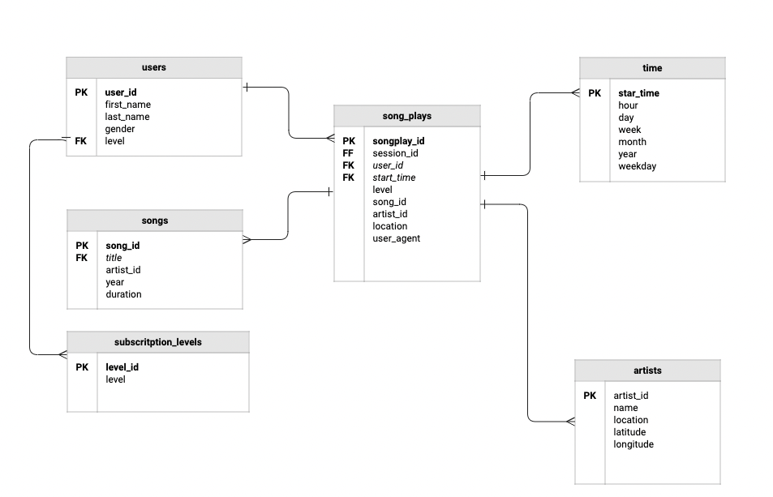

# Project 1: Data modelling with Postgres
The Udacity Data Enginerring project has a database called `sparkifydb` for a music app.
The project aims to manipulate and model database tables in order into inset data about historical music streaming for later analysis.
The dataase is optimised for queries on records of streaming analysis.  

# Database Schema design 
The database schema was designed with the original json data in mind, ensuring that each unique attribute such as song, artists, users, songplays and time had an individual table in the database schema with forign key references where applicable. As songplays in the central data of analytical interest this is the fact table and the other 4 (users, songs, artists & time) are dimension tables. An optional level table could be created for suscription information. 



# How to use the scripts.
1. To create the tables inside the database run the intial create_tables.py file. 
2. The create_tables.py references queries outline in sql_queries.py
     - uses queries defined the variables drop_tables, create_tables, song_select etc. 
3. Use the etl.py file to extract data from json files, manipulate dataframes according to which fields are relevant for insertion into the tables.

# Example queries 
Select all the sessions from a particular user
``` SELECT  session_id, start_time, song_id FROM song_plays WHERE user_id = 39 ```

Select all song play sessions from a particular artist 
``` SELECT song_plays.session_id, songs.title, time.day, song_plays.user_id, artists.name FROM  song_plays LEFT JOIN songs ON song_plays.song_id = songs.song_id LEFT JOIN time ON song_plays.start_time = time.start_time  LEFT JOIN artist on song_plays.atist_id = artists.artist_id WHERE artist_id = ARD7TVE1187B99BFB1 ```

## Development environment 
1. ``` export FLASK_APP=music.py```
2. ```export FLASK_ENV=development```
3. ``` flask run```